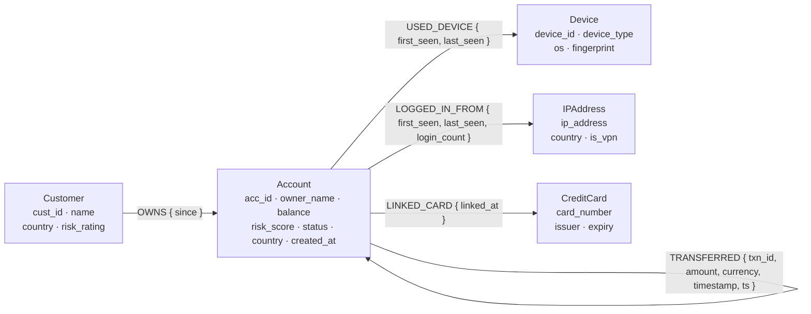
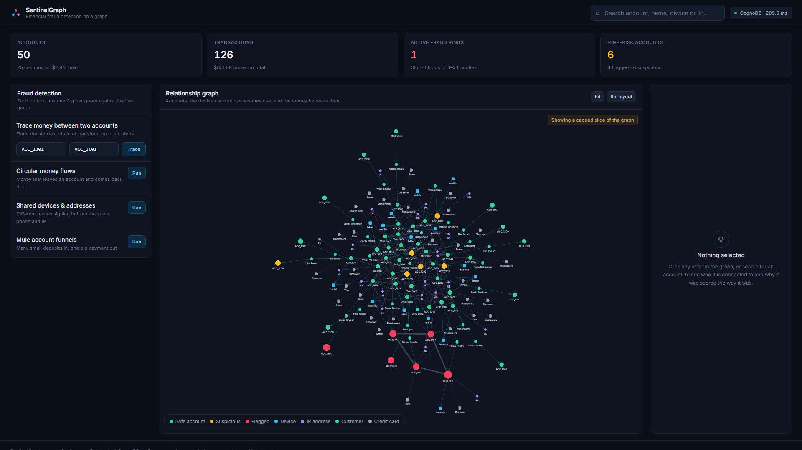
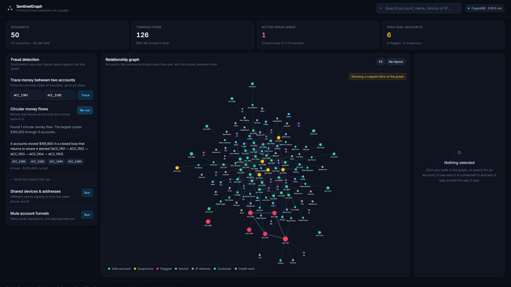
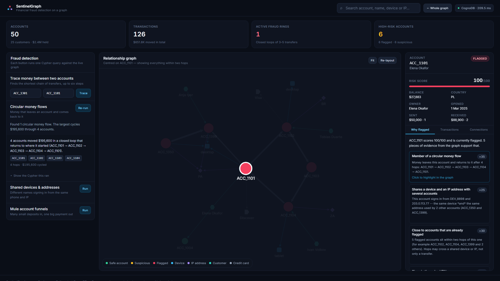
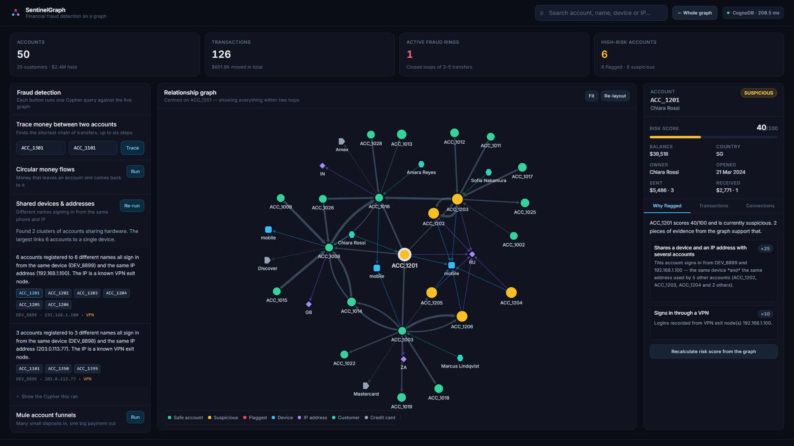
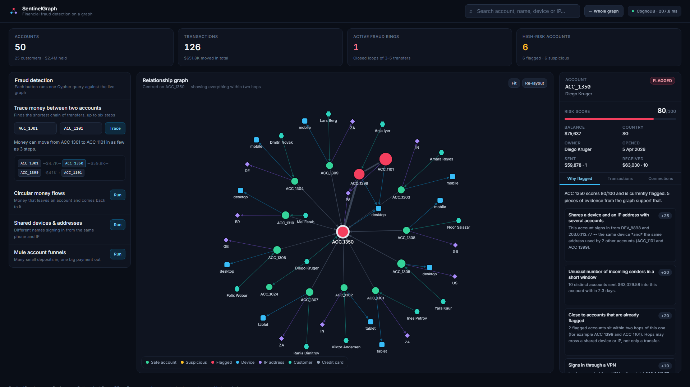
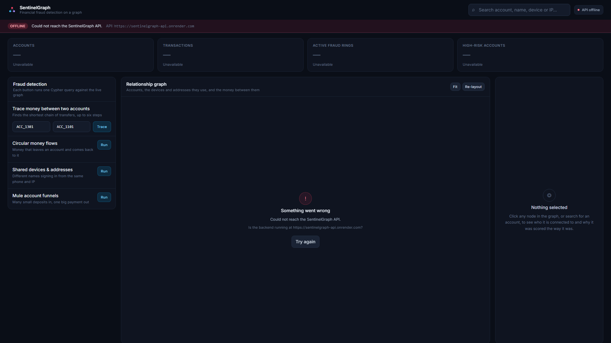

# SentinelGraph

**Graph-based financial fraud detection, built on [CognoDB](https://console.cognodb.com) with openCypher over Bolt.**

Fraud is rarely visible in a single row. One account receiving $4,000 is unremarkable. Ten accounts each sending $4,000 into one account that immediately wires 95% of it offshore is a mule funnel. Four accounts trading $50,000 between them is a laundering ring. Six accounts registered to six different names signing in from one phone is a fraud farm.

None of these are properties of a record. They are properties of a **shape in the network** — and that is what SentinelGraph looks for.

> 🔗 **Live demo:** <https://sentinelgraph.vercel.app> · **API:** <https://sentinelgraph-api.onrender.com/health>
> 📺 **Screen recording:** _add your recording link here_ (see [`docs/recording.md`](docs/recording.md))
>
> _The API runs on Render's free tier and sleeps after inactivity — the first request can take up to a minute while it wakes. The UI shows a loading state rather than an error._

---

## Contents

- [Why a graph database?](#why-a-graph-database)
- [What the app does](#what-the-app-does)
- [Data model](#data-model)
- [Architecture](#architecture)
- [Quick start](#quick-start)
- [Setting up CognoDB Cloud](#setting-up-cognodb-cloud)
- [Environment configuration](#environment-configuration)
- [The seed data](#the-seed-data)
- [The queries, explained](#the-queries-explained)
- [Risk scoring](#risk-scoring)
- [API reference](#api-reference)
- [Project structure](#project-structure)
- [Engineering notes](#engineering-notes)
- [Screenshots](#screenshots)
- [Deployment](#deployment)
- [Known limitations](#known-limitations)

---

## Why a graph database?

The whole application rests on one question: *does money leaving this account eventually come back to it?* That question has no fixed answer length. The cycle might be three hops or five. A relational schema has to know the depth before it can be written; a graph database does not.

### The same question, both ways

Here is the ring detector in Cypher — the actual query this app ships:

```cypher
MATCH path = (a:Account {acc_id: $acc_id})-[:TRANSFERRED*3..5]->(a)
RETURN [n IN nodes(path) | n.acc_id] AS account_chain,
       [r IN relationships(path) | r.amount]  AS amounts,
       length(path) AS hops
```

`*3..5` *is* the variable depth. One line, one parameter, done.

The relational equivalent over `accounts(id)` and `transfers(from_id, to_id, amount)` needs a recursive CTE:

```sql
WITH RECURSIVE walk(origin, current, depth, chain) AS (
    SELECT t.from_id, t.to_id, 1, ARRAY[t.from_id, t.to_id]
      FROM transfers t
     WHERE t.from_id = :acc_id

    UNION ALL

    SELECT w.origin, t.to_id, w.depth + 1, w.chain || t.to_id
      FROM walk w
      JOIN transfers t ON t.from_id = w.current
     WHERE w.depth < 5                 -- must be hardcoded
       AND NOT t.to_id = ANY(w.chain)  -- manual cycle guard, or this never terminates
)
SELECT chain, depth FROM walk
 WHERE current = origin AND depth BETWEEN 3 AND 5;
```

Both work. But look at what the SQL version costs:

| | Cypher | SQL |
|---|---|---|
| Expressing "3 to 5 hops" | `*3..5` | a recursive CTE with a hand-written depth guard |
| Cost per hop | pointer hop from a node to its adjacent relationships | a fresh index probe and join against the whole `transfers` table |
| Preventing runaway recursion | the engine tracks path uniqueness | you write `NOT ... = ANY(chain)` yourself |
| Changing 5 hops to 7 | change two characters | re-reason about the termination condition and re-plan the query |
| Returning the path itself | `nodes(path)` | accumulate an array by hand, hop by hop |

That last row is the practical one. An analyst does not want to know *that* a ring exists — they want to see it: which accounts, in what order, for how much. In Cypher the path is a first-class value. In SQL you rebuild it manually as you recurse.

### The query relational databases find genuinely awkward

Ring detection is the headline, but **risk propagation** ([Q3](#q3--risk-propagation)) is the one that has no clean relational answer at all:

```cypher
MATCH path = (target:Account {acc_id: $acc_id})-[*1..2]-(flagged:Account {status: 'FLAGGED'})
WHERE target <> flagged
RETURN flagged.acc_id, min(length(path)) AS distance
```

Read the pattern carefully: `-[*1..2]-`. **No relationship type and no direction.** It asks *"is this account within two hops of a known-fraudulent one, by any route at all?"* — and a route may be a transfer, or a shared device, or a shared IP address, or a common owner. Any of them. In either direction.

In SQL, "any relationship type" means a `UNION` across every join table you own, and "two hops" means doing it twice and joining the results. Adding a sixth entity type — a shared postal address, a phone number — means editing that query. In the graph it means adding a relationship type, and the *existing* query picks it up for free, because the traversal was never coupled to the schema in the first place.

That is the real argument. Relational schemas make you name your joins in advance. This use case is precisely one where you cannot: fraudsters connect accounts in whatever way you have not thought of yet.

### The honest counterpoint

For "what is ACC_1101's balance?" a relational database is perfectly good and probably faster. Graphs earn their place here specifically because the interesting questions are about *paths of unknown length between entities of mixed type* — and every question in this application is one of those.

---

## What the app does

An analyst opens SentinelGraph and sees the whole network. From there they can:

- **Scan the portfolio** — four tiles: accounts, transactions, active fraud rings, high-risk accounts.
- **Explore visually** — a Cytoscape.js canvas where node colour is risk, node size is score, edge thickness is transfer amount, and clicking anything re-centres the investigation.
- **Search** — by account id, owner name, device id or IP address, in one box.
- **Run four detectors** — circular money flows, shared devices and addresses, mule funnels, and a point-to-point money trace. Each returns a plain-English headline first and raw ids second.
- **Ask "why?"** — the standout feature. Select any account and the **Why flagged** tab lists each piece of evidence in the graph that contributed to its score, in English, with the points it added. Click a reason and the responsible subgraph lights up on the canvas while everything else dims.

That last part is the design thesis: a fraud score nobody can explain is a fraud score nobody can act on. Because the model is a graph, every verdict traces back to the exact subgraph that produced it.

---

## Data model



### Nodes

| Label | Key | Properties |
|---|---|---|
| `Account` | `acc_id` | `owner_name`, `balance`, `risk_score` (0–100), `status`, `country`, `created_at` |
| `Customer` | `cust_id` | `name`, `country`, `risk_rating` (`LOW`/`MEDIUM`/`HIGH`) |
| `Device` | `device_id` | `device_type`, `os`, `fingerprint` |
| `IPAddress` | `ip_address` | `country`, `is_vpn` |
| `CreditCard` | `card_number` | `issuer`, `expiry` (numbers are masked at rest: `****-****-****-4821`) |

`Account.status` is exactly one of **`SAFE`**, **`SUSPICIOUS`**, **`FLAGGED`**, derived from `risk_score` — see [Risk scoring](#risk-scoring).

### Relationships

| Type | Pattern | Properties |
|---|---|---|
| `OWNS` | `(:Customer)→(:Account)` | `since` |
| `TRANSFERRED` | `(:Account)→(:Account)` | `txn_id`, `amount`, `currency`, `timestamp`, `ts` |
| `USED_DEVICE` | `(:Account)→(:Device)` | `first_seen`, `last_seen` |
| `LOGGED_IN_FROM` | `(:Account)→(:IPAddress)` | `first_seen`, `last_seen`, `login_count` |
| `LINKED_CARD` | `(:Account)→(:CreditCard)` | `linked_at` |

**Two modelling decisions worth defending in review:**

1. **Time is stored twice.** `timestamp` is an ISO-8601 string for display; `ts` is epoch seconds for arithmetic. Temporal function support varies across openCypher implementations, and an integer subtraction (`(last_ts - first_ts) / 86400.0`) works on every one of them. Portability beat elegance.

2. **Devices and IPs are nodes, not columns on `Account`.** This is the decision the whole application depends on. As a column, "which other accounts used this device?" is a self-join on a string. As a node, it is an edge you can traverse — and, critically, it lets the untyped `-[*1..2]-` traversal in Q3 cross *through* a shared device without that query knowing devices exist.

### Constraints and indexes

Created by the seed script from `backend/queries/cypher.py`:

```cypher
CREATE CONSTRAINT account_id_unique  IF NOT EXISTS FOR (a:Account)     REQUIRE a.acc_id       IS UNIQUE;
CREATE CONSTRAINT customer_id_unique IF NOT EXISTS FOR (c:Customer)    REQUIRE c.cust_id      IS UNIQUE;
CREATE CONSTRAINT device_id_unique   IF NOT EXISTS FOR (d:Device)      REQUIRE d.device_id    IS UNIQUE;
CREATE CONSTRAINT ip_unique          IF NOT EXISTS FOR (i:IPAddress)   REQUIRE i.ip_address   IS UNIQUE;
CREATE CONSTRAINT card_unique        IF NOT EXISTS FOR (cc:CreditCard) REQUIRE cc.card_number IS UNIQUE;

CREATE INDEX account_status IF NOT EXISTS FOR (a:Account) ON (a.status);
CREATE INDEX account_risk   IF NOT EXISTS FOR (a:Account) ON (a.risk_score);
CREATE INDEX account_owner  IF NOT EXISTS FOR (a:Account) ON (a.owner_name);
```

The unique constraints also make the seed script idempotent: every write is a `MERGE` on a constrained key, so re-running it converges rather than duplicating.

---

## Architecture

```
┌─────────────────────────────┐
│  React 18 + Vite            │   Vercel
│  Tailwind · Cytoscape.js    │
└─────────────┬───────────────┘
              │  HTTPS / JSON   (VITE_API_BASE_URL)
┌─────────────▼───────────────┐
│  FastAPI                    │   Render (Docker)
│    routes/   HTTP only      │
│    services/ logic + prose  │
│    queries/  Cypher only    │
│    database/ one driver     │
└─────────────┬───────────────┘
              │  Bolt 5.x over TLS
┌─────────────▼───────────────┐
│  neo4j Python driver        │
└─────────────┬───────────────┘
              │  bolt+s://
┌─────────────▼───────────────┐
│  CognoDB Cloud (free c0)    │
└─────────────────────────────┘
```

The layering rule is strict and one-directional: **nothing below a layer imports from above it**, and `database/connection.py` is the only module in the codebase that calls `session.run()`. Every query in the app funnels through one function, which is what makes the timeout, the retry, the parameterisation guarantee and the error translation apply *everywhere* rather than wherever someone remembered them.

---

## Quick start

**Prerequisites:** Python 3.11+, Node 18+, and a CognoDB Cloud instance ([two minutes](#setting-up-cognodb-cloud)).

```bash
git clone <your-repo-url> sentinelgraph
cd sentinelgraph

# 1 — Backend dependencies
python -m venv .venv
source .venv/bin/activate        # Windows: .venv\Scripts\activate
pip install -r backend/requirements.txt

# 2 — Credentials
cp backend/.env.example backend/.env
#    ...then paste your CognoDB URI and password into backend/.env

# 3 — Load the demo dataset (140 nodes, 306 relationships)
python seed/seed_database.py

# 4 — Start the API   → http://localhost:8000/docs
cd backend && uvicorn main:app --reload

# 5 — Start the UI (new terminal)   → http://localhost:5173
cd frontend
cp .env.example .env
npm install
npm run dev
```

Useful seed flags:

```bash
python seed/seed_database.py --dry-run   # print the plan and computed scores, write nothing
python seed/seed_database.py --reset     # wipe the graph, then reload it
```

`--dry-run` needs no database connection at all, which makes it a fast way to inspect the dataset before committing to a load.

---

## Setting up CognoDB Cloud

1. **Sign up** at [console.cognodb.com/signup](https://console.cognodb.com/signup). The free tier needs no card.
2. **Create a free (c0) instance** and pick a region. It provisions in under a minute. Each workspace gets one.
3. **Copy the credentials immediately.** You get a URI like `bolt+s://<instance-id>.databases.cognodb.cloud`, the user `cognodb`, and a generated password **shown exactly once**. Paste them straight into `backend/.env`.
4. **Verify the connection:**
   ```bash
   python seed/seed_database.py --dry-run   # no connection needed
   python seed/seed_database.py             # connects, applies schema, loads data
   ```
   The script prints a clear, actionable message for each failure mode — wrong password, unreachable host, missing variable — rather than a driver stack trace.

**Free-tier sizing.** The c0 instance is burstable 0.5 vCPU / 256 MB RAM / 1 GB disk / 200 connections. The demo dataset (140 nodes, 306 relationships) sits far inside that, and the application is written to respect it: the connection pool defaults to 15, every traversal is depth-bounded, and every query carries a `LIMIT`.

---

## Environment configuration

Credentials are read from the environment and **never committed**. `.env` is gitignored; only `.env.example` is tracked.

**`backend/.env`**

| Variable | Required | Default | Purpose |
|---|:---:|---|---|
| `COGNODB_URI` | ✅ | — | `bolt+s://<instance-id>.databases.cognodb.cloud` |
| `COGNODB_USER` | ✅ | `cognodb` | Instance user |
| `COGNODB_PASSWORD` | ✅ | — | Shown once at creation |
| `PORT` | | `8000` | HTTP port |
| `CORS_ORIGINS` | | `http://localhost:5173` | Comma-separated allowed origins |
| `MAX_CONNECTION_POOL_SIZE` | | `15` | Bolt pool ceiling |
| `QUERY_TIMEOUT_SECONDS` | | `15` | Client-side query timeout |

**`frontend/.env`**

| Variable | Default | Purpose |
|---|---|---|
| `VITE_API_BASE_URL` | `http://localhost:8000` | Where the UI looks for the API |

Config is validated at startup by `pydantic-settings`. A missing variable produces a message naming exactly what is absent — and the API still boots and serves `/health`, so the UI can show an honest offline banner instead of the deployment simply failing.

---

## The seed data

`seed/seed_database.py` generates a deterministic dataset from a fixed random seed, so every run — and every screenshot in this README — produces an identical graph.

| Entity | Count |
|---|---:|
| Accounts | 50 |
| Customers | 25 |
| Devices | 15 |
| IP addresses | 20 |
| Credit cards | 30 |
| Transfers | 126 |

**Resulting risk distribution:** 6 flagged · 6 suspicious · 38 safe.

### The three planted scenarios

**1 — Circular laundering ring.** `ACC_1101 → ACC_1102 → ACC_1103 → ACC_1104 → ACC_1101`, roughly $50,000 cycling with a small decrement each hop (50,000 → 49,200 → 48,500 → 47,900), spread over eight days. The decrements matter: a perfectly round loop looks like a data error, a decaying one looks like trade.

**2 — Shared infrastructure fraud.** `ACC_1201` … `ACC_1206` — six accounts, six different owner names — all sign in from device `DEV_8899` and IP `192.168.1.100` (a VPN exit node).

**3 — Mule funnel.** Ten accounts (`ACC_1301`…`ACC_1310`) each deposit $2,000–$9,500 into `ACC_1350` inside a 72-hour window. `ACC_1350` then forwards 95% of the total to `ACC_1399`, registered in the Cayman Islands.

**The bridge.** `ACC_1399` also transfers $41,000 to `ACC_1101`. Scenarios 1 and 3 look like separate incidents in a table. In the graph they are visibly one operation — and the money-flow trace from `ACC_1301` to `ACC_1101` walks straight through it. That single edge is why the demo is worth watching.

### Why the background traffic is a DAG

The 110 ordinary transfers are generated so money only flows from a lower rank to a higher one in a random shuffle of the accounts, which makes the background acyclic by construction.

This is deliberate, and the first version did not do it. 110 random directed edges over 34 accounts produce *dozens* of accidental 3-to-5-hop loops — the ring detector returned them all, and 26 of 50 accounts scored as suspicious purely from noise. Making the noise acyclic means **every cycle in the finished graph is one we planted**, so the detector's output is verifiable. The ranking is a shuffle rather than account-id order, so the direction of any individual payment still looks arbitrary.

---

## The queries, explained

All Cypher lives in [`backend/queries/cypher.py`](backend/queries/cypher.py) as named constants. **No query in this codebase is built by string concatenation** — every runtime value is a `$parameter` handed to the driver separately, including optional filters, which use the `($param IS NULL OR ...)` idiom so one static query serves several filter combinations.

### Q1 — Circular money laundering `*3..5`

```cypher
MATCH path = (a:Account {acc_id: $acc_id})-[:TRANSFERRED*3..5]->(a)
RETURN [n IN nodes(path) | n.acc_id]      AS account_chain,
       [r IN relationships(path) | r.amount] AS amounts,
       length(path) AS hops
ORDER BY hops ASC
LIMIT $limit
```

Finds closed loops of 3 to 5 transfers returning to the origin. The scan variant seeds only from non-`SAFE` accounts (`WITH seed ORDER BY seed.risk_score DESC LIMIT $seed_limit`) so the free instance is never asked to test all 50 accounts for cycle membership.

A cycle is discovered once per member and once per rotation, so `fraud_service._ring_key()` canonicalises each result to a sorted member set and collapses the duplicates in Python — cheaper than asking the database to deduplicate paths.

### Q2 — Shared infrastructure

```cypher
MATCH (a1:Account)-[:LOGGED_IN_FROM]->(ip:IPAddress)<-[:LOGGED_IN_FROM]-(a2:Account)
MATCH (a1)-[:USED_DEVICE]->(d:Device)<-[:USED_DEVICE]-(a2)
WHERE a1.acc_id < a2.acc_id
RETURN a1.acc_id, a2.acc_id, ip.ip_address, ip.is_vpn, d.device_id
```

Two `MATCH` clauses that must agree on **both** endpoints: `a1` and `a2` share an IP *and* a device. `a1.acc_id < a2.acc_id` reports each unordered pair exactly once — cheaper than a `DISTINCT` over a doubled result set.

The query returns pairs; the service rolls them up into one cluster per (IP, device) so the analyst reads *"six accounts share this phone"* rather than fifteen pair rows.

### Q3 — Risk propagation

```cypher
MATCH path = (target:Account {acc_id: $acc_id})-[*1..2]-(flagged:Account {status: 'FLAGGED'})
WHERE target <> flagged
RETURN flagged.acc_id, min(length(path)) AS distance,
       [n IN nodes(path) | coalesce(n.acc_id, n.device_id, n.ip_address)] AS via
```

Untyped, undirected, bounded at two hops. This is the query with no clean relational analogue — see [Why a graph database?](#the-query-relational-databases-find-genuinely-awkward). `via` returns the actual route, using `coalesce` to pull whichever identifier each intermediate node happens to have, so the UI can say *"connected through DEV_8898"* rather than just asserting proximity.

### Q4 — Money flow tracing

```cypher
MATCH path = (a:Account {acc_id: $source})-[:TRANSFERRED*1..6]->(b:Account {acc_id: $destination})
RETURN [n IN nodes(path) | n.acc_id] AS chain,
       [r IN relationships(path) | r.amount] AS amounts,
       length(path) AS hops
ORDER BY hops ASC
LIMIT $limit
```

This is deliberately **not** `shortestPath()`. A bounded match ordered by `length(path)` returns the same answer, works on openCypher engines that do not implement `shortestPath`, and — unlike the built-in — also returns the *runners-up*, which is what an analyst actually wants when asking how else money could have travelled. Six hops is the ceiling: an unbounded `*` will exhaust 256 MB of RAM.

### Q5 — Mule funnel detection

```cypher
MATCH (sender:Account)-[t:TRANSFERRED]->(mule:Account)
WITH mule, count(DISTINCT sender.acc_id) AS inbound_count, sum(t.amount) AS inbound_total,
     min(t.ts) AS first_ts, max(t.ts) AS last_ts, collect(DISTINCT sender.acc_id) AS senders
WHERE inbound_count >= $min_senders
MATCH (mule)-[out:TRANSFERRED]->(dest:Account)
WITH mule, inbound_count, inbound_total, first_ts, last_ts, senders,
     dest, sum(out.amount) AS outbound_total
WHERE outbound_total >= inbound_total * $payout_ratio
RETURN mule.acc_id, inbound_count, inbound_total, senders,
       (last_ts - first_ts) / 86400.0 AS window_days,
       dest.acc_id AS destination, outbound_total
```

Aggregate-then-filter, twice: fan **in** (many distinct senders) followed by fan **out** (most of it forwarded to one destination). The time window falls out of `min(t.ts)`/`max(t.ts)` as plain integer arithmetic. Neither half is suspicious alone — the pattern is the conjunction, which is why this needs one query rather than two reports someone has to correlate by hand.

---

## Risk scoring

The score is a transparent additive rule set, not a model. An analyst has to be able to read the reason an account was frozen — so every factor is one bounded query returning its own points *and* its own human-readable explanation.

| Signal | Points |
|---|---:|
| Baseline | +5 |
| Member of a `TRANSFERRED` cycle of 3–5 hops | +35 |
| Shares **both** a device and an IP with ≥ 2 other accounts | +25 |
| Shares **both** a device and an IP with exactly 1 other account | +15 |
| ≥ 8 distinct inbound senders within a 7-day window | +20 |
| Each `FLAGGED` account within 2 hops (capped at +30) | +10 each |
| Logged in from a VPN exit node | +10 |

**Derived status:** `≥ 70 → FLAGGED` · `40–69 → SUSPICIOUS` · `< 40 → SAFE`. The total is clamped to 0–100.

Two details worth pointing at:

**The shared-infrastructure factor requires the device *and* the IP to match.** With 50 accounts signing in from 15 devices, a shared device alone is ordinary — using it as a signal flags half the portfolio. A shared full fingerprint is not ordinary. The risk factor deliberately mirrors Q2's join so the score and the detector can never disagree about what "shared infrastructure" means.

**The weights live in exactly one place.** `backend/services/risk_service.py` defines them as constants; `seed/seed_database.py` imports that module and applies the identical rules offline to the graph it just generated. The numbers the seed writes and the numbers `POST /detect/risk-score` computes cannot drift, because there is only one copy.

---

## API reference

Interactive docs at `/docs` once the server is running.

### System
| Method | Path | Notes |
|---|---|---|
| `GET` | `/health` | Never 5xx for a server problem. Reports `connected` / `degraded` / `unreachable` plus latency. |

### Dashboard, graph and search
| Method | Path | Notes |
|---|---|---|
| `GET` | `/stats` | The four dashboard tiles plus entity counts. |
| `GET` | `/graph?focus=&depth=&limit=` | Cytoscape node/edge payload. `depth` is 1 or 2; omit `focus` for the overview. |
| `GET` | `/search?q=&limit=` | Accounts, owner names, devices, IPs — one query. |

### Accounts
| Method | Path |
|---|---|
| `GET` | `/accounts?status=&min_risk=&page=&page_size=` |
| `GET` | `/accounts/{acc_id}` |
| `GET` | `/accounts/{acc_id}/transactions?direction=in\|out\|both` |
| `GET` | `/accounts/{acc_id}/connections` |
| `GET` | `/accounts/{acc_id}/explain` |

### Detection
| Method | Path | Notes |
|---|---|---|
| `GET` | `/detect/rings?acc_id=&limit=&seed_limit=` | Omit `acc_id` to scan. |
| `GET` | `/detect/shared-infrastructure?limit=` | |
| `GET` | `/detect/mules?min_senders=&payout_ratio=` | |
| `POST` | `/trace-path` | Body `{ source, destination }`. |
| `POST` | `/detect/risk-score` | Body `{ acc_id, persist }`. Writes the new score back. |

Detectors are `GET` because they are read-only, idempotent and cacheable, and a result should be linkable. `POST` is reserved for the call that mutates state and the one that genuinely wants a body.

Every detector returns the same envelope, so the UI renders them all through one component:

```jsonc
{
  "detector": "rings",
  "title":    "Circular money laundering",
  "headline": "Found 1 circular money flow. The largest cycles $195,600 through 4 accounts.",
  "count":    1,
  "results":  [ /* each with its own plain-English `summary` */ ],
  "parameters": { "seed_limit": 30, "limit": 25 },
  "cypher":   "MATCH path = ..."   // shown in the UI behind "Show the Cypher this ran"
}
```

### Errors

One shape, always:

```json
{ "error": { "code": "database_unreachable", "message": "...", "detail": "..." } }
```

| Situation | Status | `code` |
|---|---:|---|
| Database unreachable / not configured | 503 | `database_*` |
| Invalid credentials | 503 | `database_invalid_credentials` |
| Query timeout | 504 | `timeout` |
| Account not found | 404 | `account_not_found` |
| Malformed account id | 422 | `invalid_request` |
| Unexpected failure | 500 | `internal_error` |

Messages are written for a human reader. Stack traces, the connection URI and credentials are logged server-side and never serialised into a response.

---

## Project structure

```
sentinelgraph/
├── backend/
│   ├── database/connection.py   # the ONLY place session.run() is called
│   ├── queries/cypher.py        # every Cypher statement, as named constants
│   ├── models/schemas.py        # Pydantic response contracts
│   ├── routes/                  # health · graph · detection · accounts
│   ├── services/
│   │   ├── account_service.py
│   │   ├── fraud_service.py     # the four detectors + result shaping
│   │   ├── risk_service.py      # scoring rules and weights (single source)
│   │   ├── explain_service.py   # narrative + highlight subgraphs
│   │   ├── graph_service.py     # Cytoscape payload assembly
│   │   └── formatting.py        # plain-language helpers
│   ├── config.py                # env validation, fails fast and legibly
│   ├── main.py                  # app wiring, CORS, error handlers
│   └── requirements.txt
├── frontend/
│   └── src/
│       ├── api/client.js        # every request; normalises errors to ApiError
│       ├── hooks/useAsync.js    # idle · loading · error · data, with abort
│       ├── components/
│       │   ├── GraphView.jsx        # Cytoscape canvas, legend, highlighting
│       │   ├── DetectionPanel.jsx   # the four detectors
│       │   ├── DetailSidebar.jsx    # details · why-flagged · transactions · connections
│       │   ├── SearchBar.jsx        # debounced, keyboard-navigable
│       │   ├── StatTiles.jsx
│       │   ├── HealthBanner.jsx
│       │   └── states.jsx           # loading · empty · error, shared
│       └── App.jsx
├── seed/seed_database.py
├── docs/recording.md
├── screenshots/
├── Dockerfile · docker-compose.yml · render.yaml
└── .gitignore                   # .env is never tracked
```

---

## Engineering notes

**One driver, created once.** The `AsyncDriver` is built in the FastAPI `lifespan` hook and closed on shutdown. A per-request driver would exhaust the c0 instance's 200-connection budget almost immediately; the pool is capped at 15.

**One choke point for queries.** `database/connection.py::_execute` is the only function that runs Cypher. Because everything passes through it, the client-side timeout, the single retry on transient `ServiceUnavailable`, the parameterisation guarantee and the exception-to-HTTP translation apply universally instead of wherever someone remembered to add them.

**Client-side timeouts, not server-side.** `asyncio.wait_for` rather than transaction metadata, because transaction-timeout support varies across openCypher engines. It costs nothing and removes a compatibility dependency.

**The app boots without a database.** Startup logs a warning and continues, so `/health` answers and the UI renders an honest offline banner. A deployment that cannot reach CognoDB should tell you that clearly, not fail to start.

**Portability fallbacks are real, not decorative.** `/search` and `/accounts/{id}/transactions` use `CALL {}` subqueries with automatic fallbacks to simpler queries if the engine rejects them. The seed script warns and continues if named constraints are unsupported. `shortestPath()`, `datetime()` arithmetic and APOC are avoided entirely.

**Frontend state is explicit.** `useAsync` exposes `idle | loading | error | data` and aborts in-flight requests on unmount or dependency change, so clicking quickly through accounts never lands a stale result in the sidebar. Every async view renders a skeleton, a written empty state and a retryable error state — there is no silent blank panel anywhere in the app.

**Accessibility.** Visible focus rings, `role="meter"` on the risk gauge, `role="listbox"` with arrow-key navigation in search, `aria-live` error roles, and `prefers-reduced-motion` honoured globally.

---

## Screenshots

Place the images below in `screenshots/` and they will render here.

| | |
|---|---|
| **Dashboard and graph overview** — stat tiles, the full network, the legend |  |
| **Ring detection** — a plain-English headline with the cycle highlighted |  |
| **Why flagged** — evidence with points, each one clickable to highlight |  |
| **Shared infrastructure** — six accounts, one phone, one VPN address |  |
| **Money trace** — `ACC_1301 → ACC_1350 → ACC_1399 → ACC_1101` |  |
| **Offline state** — how the app behaves when CognoDB is unreachable |  |

---

## Deployment

### Backend → Render

1. Push this repository to GitHub.
2. In Render: **New → Blueprint**, point it at the repo. `render.yaml` provisions a free Docker web service with `/health` as the health check.
3. Set the secrets Render prompts for: `COGNODB_URI`, `COGNODB_PASSWORD`, and `CORS_ORIGINS` (your Vercel URL).
4. Deploy, then confirm `https://<service>.onrender.com/health` reports `"database": "connected"`.

> Render's free tier sleeps after inactivity, so the first request after a pause takes ~30 seconds. The UI shows a loading state rather than an error while it wakes.

### Frontend → Vercel

1. In Vercel: **New Project**, set the root directory to `frontend/`.
2. Add `VITE_API_BASE_URL` = your Render URL. Vite inlines it at build time, so **redeploy after changing it**.
3. Deploy. `vercel.json` handles the SPA rewrite.
4. Go back to Render and add the Vercel domain to `CORS_ORIGINS`.

### Docker (either)

```bash
docker compose up --build          # reads backend/.env
# or
docker build -t sentinelgraph-api .
docker run -p 8000:8000 --env-file backend/.env sentinelgraph-api
```

---

## Known limitations

- **Depth is a literal, not a parameter.** openCypher does not allow `*1..$depth`, so `/graph` offers depths 1 and 2 as two separate constants rather than an arbitrary number. Honest constraint, deliberate design.
- **Ring scanning is seeded, not exhaustive.** The portfolio scan starts from the 30 highest-risk non-`SAFE` accounts. A ring composed entirely of accounts that look clean would be missed by the scan — though it is still found by `/detect/rings?acc_id=...` for any member. This is a free-tier concession, and the parameter is exposed rather than hidden.
- **Risk scores are computed on demand, not on write.** `POST /detect/risk-score` recomputes and persists one account. A production system would recompute affected neighbourhoods on every transaction; here it is an explicit, visible action so the effect can be demonstrated.
- **No authentication.** It is a demonstration application. Real deployment would need auth, an audit log of every analyst action, and row-level access control.
- **`shortestPath()` is avoided by choice**, not because CognoDB lacks it. If your instance supports it, the bounded-and-ordered form in Q4 can be swapped for it directly.

---

<div align="center">
<sub>Built for the Wexa AI take-home assignment · openCypher over Bolt on CognoDB Cloud</sub>
</div>
